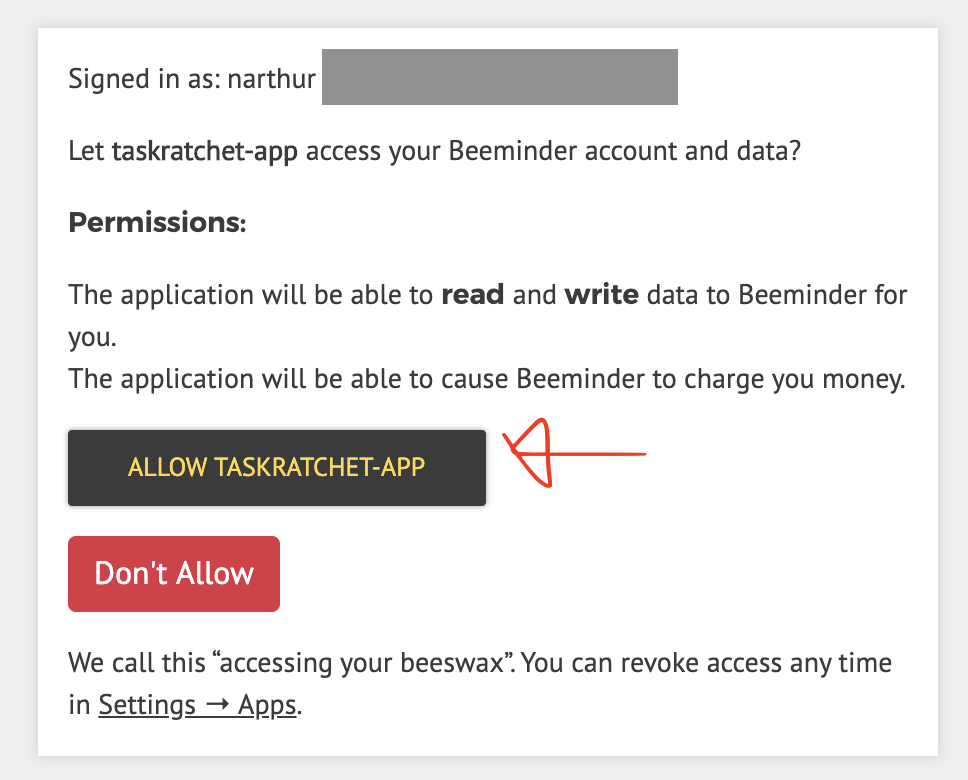
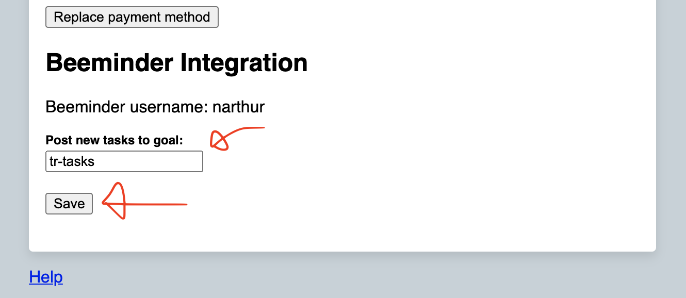

## Integrations

### Beeminder

#### Features

Enabling the Beeminder integration gives you three new features:

Input                                  | Behavior
---------------------------------------|-----------------------------------------------------------------------
Any task if goal field set in settings | On creation, posts all new tasks to specified goal
`The Task &goal-name`                  | On creation, posts tasks with `&`-tags to goal with same name as tag
`The Task *goal-name`                  | On completion, posts tasks with `*`-tags to goal with same name as tag

When a task is posted to Beeminder as a new datapoint, the following attributes are set:

Datapoint Field | Value
----------------|--------------
Date            | Date task was added, or completed if using `*`-tag
Value           | Always `1`
Comment         | Task summary, e.g., `The Task by 3/24/2021, 11:59 PM or pay $10.00`

#### Enable Beeminder Integration

To enable the integration, first navigate to your account settings.

Click "Enable Beeminder integration."

You'll be redirected to Beeminder's website. Grant TaskRatchet access to your Beeminder account.

You'll be redirected back to your account settings. Add the name of the Beeminder goal you'd like TaskRatchet to post 
your new tasks to, then click "Save."

Now, whenever you add a new task, a 1 will be posted to the goal you specified in your account settings.

In addition, you can add a `&goal-name` tag to a task's description to post to a goal on task create, and `*goal-name`
to post to the goal on task complete.
