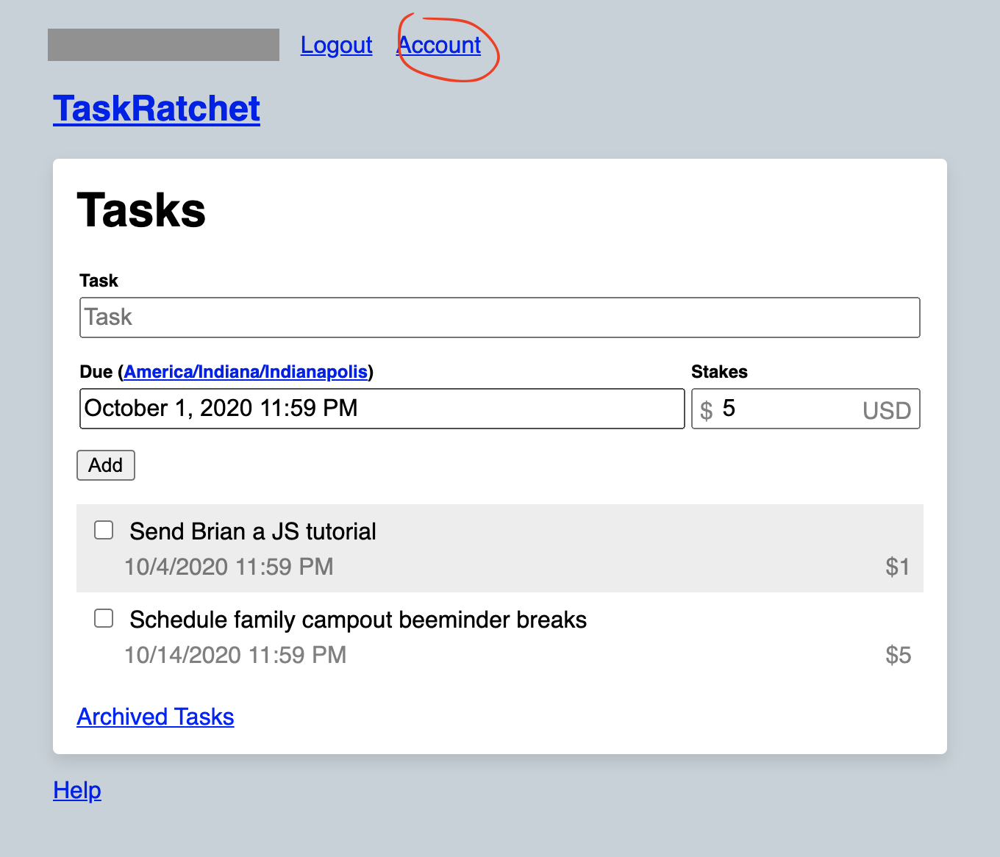
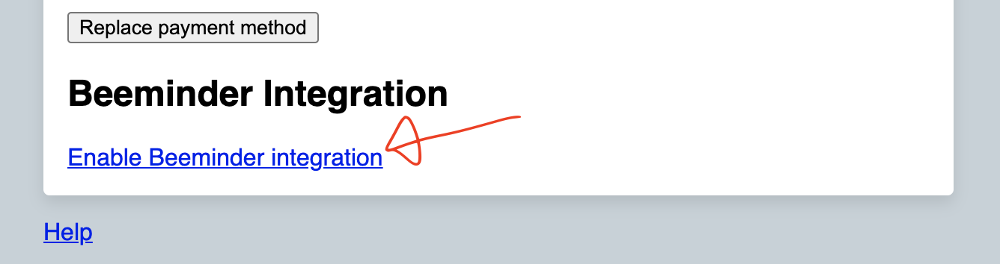

## Integrations

### Beeminder

#### Features

Enabling the Beeminder integration gives you three new features:

##### Automatically post every task you create to a Beeminder goal.

Example: If you set the Beeminder goal field in your account settings to `tasks`, TaskRatchet will try to post a 
datapoint to your `tasks` goal every time you create a new TaskRatchet task. The datapoint's comment will include your
task's description, deadline, and stakes. The datapoint's value will be `1`. 

##### Post to any Beeminder goal when you create a task by including a `&goal-name` tag in the task's description.

Example: If you create a task with the description "Send monthly report &work-tasks", TaskRatchet will immediately try
to post a datapoint to your `work-tasks` goal. The datapoint's comment will include your task's description, deadline, 
and stakes. The datapoint's value will be `1`. 

##### Post to any Beeminder goal when you complete a task by including a `*goal-name` tag in the task's description.

Example: If you create a task with the description "Do the laundry *done", TaskRatchet will wait until you complete the 
task, and then try to post a datapoint to your `done` goal. The datapoint's comment will include your task's 
description, deadline, and stakes. The datapoint's value will be `1`.

#### Enable Beeminder Integration

To enable the integration, first navigate to your account settings.

Click "Enable Beeminder integration."

You'll be redirected to Beeminder's website. Grant TaskRatchet access to your Beeminder account.

You'll be redirected back to your account settings. Add the name of the Beeminder goal you'd like TaskRatchet to post 
your new tasks to, then click "Save."

Now, whenever you add a new task, a 1 will be posted to the goal you specified in your account settings.

In addition, you can add a `&goal-name` tag to a task's description to post to a goal on task create, and `*goal-name`
to post to the goal on task complete.
